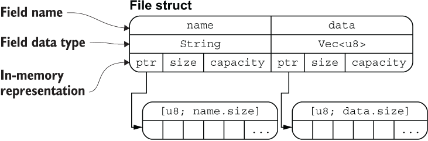

# 结构体(struct)
- 结构体由不同数据类型组合形成，因此是复合类型
- 结构体可以为内部的每个字段起一个富有含义的名称，无需依赖字段的顺序去访问和解析字段

## 结构体语法
### 定义结构体
- 结构体由以下几部分组成：
    - 使用关键字 `struct` 定义结构体
    - 结构体 `名称`
        - 见名知意的那种
    - 结构体字段
        - 结构体字段由 `字段名` 和 `字段类型` 组成，多个字段之间用 `,` 分隔 
```rust
struct User {
    active: bool,
    username: String,
    email: String,
    sign_in_count: u64,
}
```

### 创建结构体实例
- 初始化实例时，每个字段都需要进行初始化
- 初始化时的字段顺序不需要和结构体定义时的顺序一致
```rust
let user1 = User {
    email: String::from("someone@example.com"),
    username: String::from("someusername123"),
    active: true,
    sign_in_count: 1,
};
```

### 访问结构体字段
- 使用 `.` 操作符访问结构体实例内部的字段值，或者修改字段值
    - 修改字段值的前提是必须将结构体实例声明为可变的，Rust 不支持将某个结构体某个字段标记为可变
```rust
let mut user1 = User {
    email: String::from("someone@example.com"),
    username: String::from("someusername123"),
    active: true,
    sign_in_count: 1,
};

user1.email = String::from("anotheremail@example.com");
```

### 简化结构体创建
```rust
// 类似构建函数，返回 User 结构体的实例
fn build_user(email: String, username: String) -> User {
    User {
        email: email,
        username: username,
        active: true,
        sign_in_count: 1,
    }
}

// 再简化一点
fn build_user(email: String, username: String) -> User {
    User {
        email,
        username,
        active: true,
        sign_in_count: 1,
    }
}
```

### 结构体更新语法
- 根据已有的结构体实例创建新的结构体实例
```Rust
let user2 = User {
    active: user1.active,
    username: user1.username,
    email: String::from("EMAIL"),
    sign_in_count: user1.sign_in_count,
}

// 简化
let user2 = User {
    email: String::from("EMAIL"),
    // .. 语法表明凡是我们没有显式声明的字段，全部从 user1 中自动获取
    // 需要注意的是 ..user1 必须在结构体的尾部使用
    ..user1
    // username的所有权发生转移，user1无法再被使用，
    // 但是user1内部的其他字段还是可以被继续使用的

    // 所有权-Copy特征
    // Copy 特征：实现了 Copy 特征的类型无需所有权转移，
    // 可以直接在赋值时进行 数据拷贝，其中 bool 和 u64 类型就实现了 Copy 特征，
    // 因此 active 和 sign_in_count 字段在赋值给 user2 时，
    // 仅仅发生了拷贝，而不是所有权转移
}
```

## 结构体的内存排列
```rust
#[derive(Debug)]
struct File {
    name: String,
    data: Vec<u8>,
}

fn main() {
    let f1 = File {
        name: String::from("f1.txt"),
        data: Vec::new(),
    };

    let f1_name = &f1.name;
    let f1_length = &f1.data.len();

    println!("{:?}", f1);
    println!("{} is {} bytes long", f1_name, f1_length);
}
```
- String 类型的底层也是 [u8] 数组
- ptr 指针指向底层数组的内存地址，可以把 ptr 指针理解为 Rust 中的引用类型


## 元组结构体
- 结构体必须有名称, 但是结构体的字段可以没有名称, 这种结构体长得很像元组，因此被称为元组结构体
- 元组结构体在你希望有一个整体名称，但是又不关心里面字段的名称时将非常有用
```rust
struct Color(i32, i32, i32);
struct Point(i32, i32, i32);
```

## 单元结构体
- 单元结构体没有任何字段和属性, 就像单元类型一样
- 如果定义一个类型, 但是不关心该类型的内容, 只关心其行为时, 就可以使用单元结构体
```Rust
struct AlwaysEqual;

let subject = AlwaysEqual;

// 我们不关心 AlwaysEqual 的字段数据，只关心它的行为
// 因此将它声明为单元结构体，然后再为它实现某个特征
// 不是特别理解, 关心什么行为
impl SomeTrait for AlwaysEqual {

}
```

## 结构体数据的所有权
- 生命周期能确保结构体的作用范围要比结构体所借用的数据的作用范围小
- 如果结构体中使用引用类型, 就必须加上生命周期, 否则就会报错

## 使用 #[derive(Debug)] 打印结构体信息
- 使用 `{}` 可以格式化输出相应类型值的原因是Rust实现了这些类型的Display特征
- 结构体没有实现Display特征, 因此无法使用 `{}` 格式化输出
- 想用使用 `{}` 格式化输出结构体, 就需要为结构体实现Display特征
- 不想为结构体实现Display特征, 那需要为结构体实现Debug特征
- 实现Debug特征有以下两种方式
    - 手动实现
    - 使用 derive 派生实现, 详见[派生特征trait](https://course.rs/appendix/derive.html)
这里使用derive实现Debug特征
```rust
#[derive(Debug)] // 使用derive实现Debug特征
struct Rectangle {
    width: u32,
    height: u32,
}

fn main() {
    let rect1 = Rectangle {
        width: 30,
        height: 50,
    };

    // {:?} 是 Rust 自动为我们提供的实现，看上基本就跟结构体的定义形式一样
    println!("rect1 is {:?}", rect1);
    // {:#?} 的输出表现相较 {:?} 更好, 如果要更好, 需要自己实现Display特征
    println!("rect1 is {:#?}", rect1);
}

// 运行结果 
// rect1 is Rectangle { width: 30, height: 50 }
// rect1 is Rectangle {
//     width: 30,
//     height: 50,
// }
```

- 另一个简单的输出 debug 信息的方法: 使用 dbg! 宏
    - 它会拿走表达式的所有权，然后打印出相应的文件名、行号等 debug 信息，还有需要的表达式的求值结果。除此之外，它最终还会把表达式值的所有权返回
- dbg! 输出到标准错误输出 stderr，而 println! 输出到标准输出 stdout
```rust
#[derive(Debug)]
struct Rectangle {
    width: u32,
    height: u32,
}

fn main() {
    let scale = 2;
    let rect1 = Rectangle {
        width: dbg!(30 * scale),
        height: 50,
    };

    dbg!(&rect1);
}

// 运行结果
// [src/main.rs:10] 30 * scale = 60
// [src/main.rs:14] &rect1 = Rectangle {
//     width: 60,
//     height: 50,
// }
// 代码所在的文件名、行号、表达式以及表达式的值都返回了
```