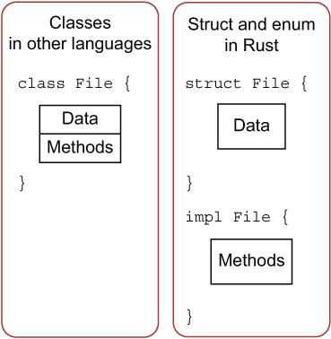

# 方法和method
- Rust 的方法往往跟结构体、枚举、特征(Trait)一起使用

## 定义方法
- Rust 使用 impl 来定义方法
    - impl 是实现 implementation 的缩写
- Rust 的对象定义和方法定义是分离的，其他语言则是对象定义和方法定义都在 class 中

```rust
struct Circle {
    x: f64,
    y: f64,
    radius: f64,
}

// impl Circle {} 表示为 Circle 实现方法
impl Circle {
    // new是Circle的关联函数，因为它的第一个参数不是self，且new并不是关键字
    // 这种方法往往用于初始化当前结构体的实例
    fn new(x: f64, y: f64, radius: f64) -> Circle {
        Circle {
            x: x,
            y: y,
            radius: radius,
        }
    }

    // Circle的方法，&self表示借用当前的Circle结构体
    fn area(&self) -> f64 {
        std::f64::consts::PI * (self.radius * self.radius)
    }
}

```

### self、&self 和 &mut self
- &self 是 self: &Self 的简写
- 在一个 impl 块内，Self 指代被实现方法的结构体类型，self 指代此类型的实例
    - 为哪个结构体实现方法，那么 self 就是指代哪个结构体的实例

```rust
#[derive(Debug)]
struct Rectangle {
    width: u32,
    height: u32,
}

impl Rectangle {
    // 用 &self 替代 rectangle: &Rectangle 
    // &self 是 self: &Self 的简写（注意大小写）
    // self 指代的是 Rectangle 结构体实例
    // Self 指代的是 Rectangle 结构体类型
    fn area(&self) -> u32 {
        self.width * self.height
    }
}

fn main() {
    let rect1 = Rectangle { width: 30, height: 50 };

    println!(
        "The area of the rectangle is {} square pixels.",
        rect1.area()
    );
}
```

- self 的使用就跟函数参数一样，要严格遵守 Rust 的所有权规则。self 所有权的概念:
    - self 表示 Rectangle 的所有权转移到该方法中，这种形式用的较少
        - 仅仅通过使用 self 作为第一个参数来使方法获取实例的所有权是很少见的，这种使用方式往往用于把当前的对象转成另外一个对象时使用，转换完后，就不再关注之前的对象，且可以防止对之前对象的误调用
    - &self 表示该方法对 Rectangle 的不可变借用
        - 选择 &self 的理由跟在函数中使用 &Rectangle 是相同的：我们并不想获取所有权，也无需去改变它，只是希望能够读取结构体中的数据
    - &mut self 表示可变借用
        - 如果想要在方法中去改变当前的结构体，需要将第一个参数改为 &mut self

- 使用方法代替函数有以下好处：
    - 不用在函数签名中重复书写 self 对应的类型
    - 代码的组织性和内聚性更强，对于代码维护和阅读来说，好处巨大

### 方法名和结构体字段名相同
- 在 Rust 中，允许方法名跟结构体的字段名相同
```rust
struct Rectangle {
    width: u32,
    height: u32,
}

impl Rectangle {
    fn width(&self) -> bool {
        self.width > 0
    }
}

fn main() {
    let rect1 = Rectangle {
        width: 30,
        height: 50,
    };

    // 当我们使用 rect1.width() 时，Rust 知道我们调用的是它的方法
    // 如果使用 rect1.width，则是访问它的字段
    if rect1.width() {
        println!("The rectangle has a nonzero width; it is {}", rect1.width);
    }
}
```
- 方法跟字段同名，往往适用于实现 getter 访问器
    - 如果一个方法（函数）的名称与类中某个字段（变量）的名称相同，那么这个方法通常被用作获取（或“读取”）该字段的值，即实现所谓的“getter”访问器。Getter访问器是一种特殊的方法，用于返回对象的私有或受保护字段的值，而不直接暴露这些字段给外部代码，从而保持对象的封装性和数据的安全性
```rust
pub struct Rectangle {
    width: u32,
    height: u32,
}

impl Rectangle {
    // Self 指代的就是被实现方法的结构体 Rectangle
    pub fn new(width: u32, height: u32) -> Self {
        Rectangle { width, height }
    }
    pub fn width(&self) -> u32 {
        return self.width;
    }
}

fn main() {
    let rect1 = Rectangle::new(30, 50);

    println!("{}", rect1.width());
}
```
Rust 有一个叫自动引用和解引用的功能。方法调用是 Rust 中少数几个拥有这种行为的地方。当使用 object.something() 调用方法时，Rust 会自动为 object 添加 &、&mut 或 * 以便使 object 与方法签名匹配。也就是说，这些代码是等价的：
```rust
p1.distance(&p2); // 第一行更简洁
(&p1).distance(&p2);

// 这种自动引用的行为之所以有效
// 是因为方法有一个明确的接收者———— self 的类型
// 在给出接收者和方法名的前提下
// Rust 可以明确地计算出方法是仅仅读取（&self），做出修改（&mut self）或者是获取所有权（self）
// 事实上，Rust 对方法接收者的隐式借用让所有权在实践中更友好
```

## 带有多个参数的方法
- 方法和函数一样，可以使用多个参数
```rust
impl Rectangle {
    fn area(&self) -> u32 {
        self.width * self.height
    }

    fn can_hold(&self, other: &Rectangle) -> bool {
        self.width > other.width && self.height > other.height
    }
}

fn main() {
    let rect1 = Rectangle { width: 30, height: 50 };
    let rect2 = Rectangle { width: 10, height: 40 };
    let rect3 = Rectangle { width: 60, height: 45 };

    println!("Can rect1 hold rect2? {}", rect1.can_hold(&rect2));
    println!("Can rect1 hold rect3? {}", rect1.can_hold(&rect3));
}
```

## 关联函数
- 定义在 impl 中且没有 self 的函数被称之为关联函数： 
    - 因为它没有 self，不能用 f.read() 的形式调用，因此它是一个函数而不是方法
    - 它又在 impl 中，与结构体紧密关联，因此称为关联函数
```rust
impl Rectangle {
    fn new(w: u32, h: u32) -> Rectangle { // 关联函数
        Rectangle { width: w, height: h }
    }
}
```
- Rust 中有一个约定俗成的规则，使用 new 来作为构造器的名称，出于设计上的考虑，Rust 特地没有用 new 作为关键字。
- 函数不能用 . 的方式来调用，需要用 :: 来调用
    - 例如 let sq = Rectangle::new(3, 3);
    - 这个方法位于结构体的命名空间中：:: 语法用于关联函数和模块创建的命名空间

## 多个 impl 定义
- Rust 允许为一个结构体定义多个 impl 块，目的是提供更多的灵活性和代码组织性
- 当方法多了后，可以把相关的方法组织在同一个 impl 块中，那么就可以形成多个 impl 块，各自完成一块目标, 示例：
```rust
impl Rectangle {
    fn area(&self) -> u32 {
        self.width * self.height
    }
}

impl Rectangle {
    fn can_hold(&self, other: &Rectangle) -> bool {
        self.width > other.width && self.height > other.height
    }
}
```

## 为枚举实现方法
```rust
#![allow(unused)]
enum Message {
    Quit,
    Move { x: i32, y: i32 },
    Write(String),
    ChangeColor(i32, i32, i32),
}

impl Message {
    fn call(&self) {
        // 在这里定义方法体
    }
}

fn main() {
    let m = Message::Write(String::from("hello"));
    m.call();
}
```